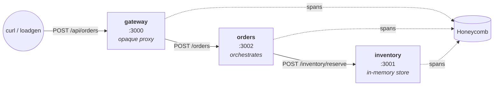

# three-services-demo-app

A small, deliberately observable application built as the **demo target** for our team's incident-investigation agent. It is _not_ the agent itself.

## What this is and why it exists

The investigation agent needs something to investigate. This repo is that "something"; three TypeScript microservices that emit OpenTelemetry traces to Honeycomb, with realistic failure modes built in (and more coming via a configurable fault-injection layer). When we demo the agent, we can point it at this app's incidents.

## Why this app provides a useful demo target

1. **Realistic without being huge.** Three services with real cross-service calls, each small enough to reason about in a few minutes. Big enough to demonstrate distributed-tracing problems matter.

2. **Multi-hop call graph.** A request flows `client → gateway → orders → inventory`. Single-hop traces only answer "did this endpoint fail?" Multi-hop traces let the agent ask the more interesting question: _"where in the chain did it fail, and why?"_ That's the question worth investigating.

3. **Built for OpenTelemetry from day one.** Hexagonal architecture (domain at center, adapters at edges) puts infrastructure boundaries exactly where OTel hooks naturally.

4. **Already-existing failure modes.** Real HTTP error paths exist today — `404 unknown_sku`, `409 insufficient`, `400 invalid_quantity`, `502 upstream_unavailable`. The agent has things to find without us writing fake bugs.

5. **Reproducible incidents on the way.** Planned fault-injection middleware will let us produce specific failure scenarios on demand for the demo. Honest services in the production code; controlled chaos at the boundary.

6. **Industry-standard observability stack.** OTel + Honeycomb is what the agent will see in real customer environments.

## Architecture



```
                                    ┌────────────┐
                                    │ Honeycomb  │
                                    └─────▲──────┘
                                          │ spans (OTel)
                ┌─────────────────────────┴─────────────────────────┐
                │                         │                         │
client ──HTTP──►  gateway  ──HTTP──►   orders   ──HTTP──►  inventory
                  :3000                 :3002                :3001
                  (proxy)              (orchestr.)         (in-mem)
```

Each request produces one trace. Spans from all three services share the same `traceId` and form a parent/child tree
the agent can walk top-down.

## Current status

| Phase                              | Status   |
| ---------------------------------- | -------- |
| Service: inventory                 | shipped  |
| Service: orders                    | shipped  |
| Service: gateway                   | shipped  |
| OTel SDK in each service           | shipped  |
| OTel → Honeycomb (sub-phase C)     | shipped  |
| Wide span attributes (sub-phase D) | shipped  |
| Fault injection layer              | shipped  |
| Load generator                     | shipped  |
| Dockerization                      | deferred |
| Terraform / deployment             | deferred |

## Services

| Service       | Port | Role                                                                                                                                                                                        |
| ------------- | ---- | ------------------------------------------------------------------------------------------------------------------------------------------------------------------------------------------- |
| **gateway**   | 3000 | Public entry point. Thin opaque proxy — forwards `POST /api/orders` and `GET /api/orders/:id` to orders without parsing payloads.                                                           |
| **orders**    | 3002 | Order orchestration. Receives orders, calls inventory to reserve stock, returns a created order. `GET /orders/:id` is intentionally synthetic — there is no order persistence in this demo. |
| **inventory** | 3001 | Stock authority. Tracks SKU quantities in memory. Validates reservation requests and rejects with typed reasons (`unknown_sku`, `insufficient`, `invalid_quantity`).                        |

All three follow the same hexagonal layout (`domain/`, `infra/`, `http/`).

## Prerequisites

You need a Honeycomb Ingest API key, scoped to the environment you send traces to. Each service reads it from its own `.env`:

```
services/gateway/.env
services/orders/.env
services/inventory/.env
```

Quickest setup: each service ships a `.env.example` you can copy:

```bash
 cp services/gateway/.env.example services/gateway/.env
 cp services/orders/.env.example services/orders/.env
 cp services/inventory/.env.example services/inventory/.env
 cp services/loadgen/.env.example services/loadgen/.env
```

Then fill in `HONEYCOMB_API_KEY` in each. The other variables have working  
localhost defaults. Set `FAULT_INJECTION_ENABLED=true` (commented in the example) to enable the opt-in fault layer

`.env` is gitignored. The key is the same across all three services (Honeycomb routes per `service.name` into separate datasets).

## Running it locally

Three terminals (one per service):

```bash
# terminal 1
cd services/inventory && npm run dev

# terminal 2
cd services/orders && INVENTORY_URL=http://localhost:3001 npm run dev

# terminal 3
cd services/gateway && ORDERS_URL=http://localhost:3002 npm run dev
```

Each prints `OTel SDK started for service: <name>` at startup.

Smoke test (gateway → orders → inventory):

```bash
curl -s -X POST http://localhost:3000/api/orders \
  -H 'Content-Type: application/json' \
  -d '{"sku":"SKU-A100","quantity":1}' | jq
```

A single curl produces spans across all three terminals sharing one `traceId`.

## Generating traffic

Loadgen is an auxiliary service (not part of the three-service demo target) that drives continuous, _mostly successful_ traffic through the gateway service. It's a separate `npm` script so you can turn traffic on deliberately. `npm run dev` does **not** start it.

```bash
# in a fourth terminal, after the services are up:
cd services/loadgen && GATEWAY_URL=http://localhost:3000 npm run dev

# OR from the repo root:
npm run dev:loadgen
```

### What loadgen does

Every tick (default 1 req/sec, configurable via `REQUESTS_PER_SECOND`), loadgen picks one of two actions:

- **~70% POST `/api/orders`** with a SKU + quantity. ~95% of the time the SKU is drawn from inventory's seeded list (`SKU-A100`, `SKU-B200`, `SKU-C300`) so the request actually succeeds; the remaining ~5% sends a random `widget-N` SKU that inventory doesn't know, producing a natural `unknown_sku` error. The mix is deliberate: a clean-enough baseline that injected faults stand out, but not so clean that the data looks fake.
- **~30% GET `/api/orders/ord-{N}`** with a random order id. Orders' `GET` is intentionally synthetic; it just echoes the id back, so these requests always succeed.

Loadgen emits its own OTel spans (`service.name=loadgen`) as the root of each trace, so in Honeycomb you'll see complete request traces that begin at loadgen and propagate through `gateway → orders → inventory`.

> **Known coupling.** Loadgen's `KNOWN_SKUS` constant has to match inventory's seed data manually, but there's no enforcement. Deliberate for now; the planned follow-up is either to drive both from one env var or to have loadgen discover SKUs from inventory at startup.

## Triggering faults for demo scenarios

The agent we're building investigates incidents. To rehearse against it, we need incidents on demand. The opt-in fault-injection layer is how we get that. See **[docs/fault-injection.md](docs/fault-injection.md)**

## What's coming

- **Dockerization:** `docker compose up` to run the full chain in one command.
