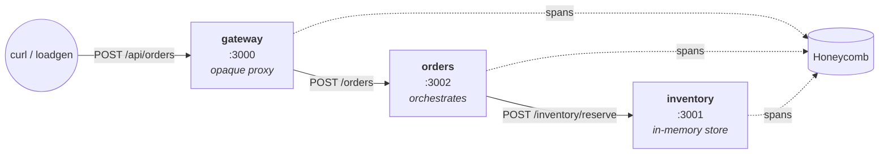

# capstone-demo-observed-app

A small, deliberately observable application built as the **demo target** for our team's incident-investigation agent. It is _not_ the agent itself.

## What this is and why it exists

The investigation agent needs something to investigate. This repo is that "something"; three TypeScript microservices that emit OpenTelemetry traces to Honeycomb, with realistic failure modes built in (and more coming via a configurable fault-injection layer). When we demo the agent, we point it at this app's incidents.

## Why this app provides a useful demo target

1. **Realistic without being huge.** Three services with real cross-service calls, each small enough to reason about in a few minutes. Big enough to demonstrate distributed-tracing problems matter.

2. **Multi-hop call graph.** A request flows `client → gateway → orders → inventory`. Single-hop traces only answer "did this endpoint fail?" Multi-hop traces let the agent ask the more interesting question: _"where in the chain did it fail, and why?"_ That's the question worth investigating.

3. **Built for OpenTelemetry from day one.** Hexagonal architecture (domain at center, adapters at edges) puts infrastructure boundaries exactly where OTel hooks naturally.

4. **Already-existing failure modes.** Real HTTP error paths exist today — `404 unknown_sku`, `409 insufficient`, `400 invalid_quantity`, `502 upstream_unavailable`. The agent has things to find without us writing fake bugs.

5. **Reproducible incidents on the way.** Planned fault-injection middleware will let us produce specific failure scenarios on demand for the demo. Honest services in the production code; controlled chaos at the boundary.

6. **Industry-standard observability stack.** OTel + Honeycomb is what the agent will see in real customer environments. Practicing on real tooling, not a toy.

## Architecture



```
                                    ┌────────────┐
                                    │ Honeycomb  │
                                    └─────▲──────┘
                                          │ spans (OTel)
                ┌─────────────────────────┴─────────────────────────┐
                │                         │                         │
client ──HTTP──►  gateway  ──HTTP──►   orders   ──HTTP──►  inventory
                  :3000                 :3002                :3001
                  (proxy)              (orchestr.)         (in-mem)
```

Each request produces one trace. Spans from all three services share the same `traceId` and form a parent/child tree
the agent can walk top-down.

## Current status

| Phase                              | Status   |
| ---------------------------------- | -------- |
| Service: inventory                 | shipped  |
| Service: orders                    | shipped  |
| Service: gateway                   | shipped  |
| OTel SDK in each service           | shipped  |
| OTel → Honeycomb (sub-phase C)     | next     |
| Wide span attributes (sub-phase D) | planned  |
| Fault injection layer              | planned  |
| Load generator                     | planned  |
| Dockerization                      | deferred |
| Terraform / deployment             | deferred |

## Services

| Service | Port | Role

| **gateway** | 3000 | Public entry point. Thin opaque proxy — forwards `POST /api/orders` and `GET /api/orders/:id` to orders without parsing payloads. |

| **orders** | 3002 | Order orchestration. Receives orders, calls inventory to reserve stock, returns a created order. `GET /orders/:id` is intentionally synthetic — there is no order persistence in this demo. |

| **inventory** | 3001 | Stock authority. Tracks SKU quantities in memory. Validates reservation requests and rejects with typed reasons (`unknown_sku`, `insufficient`, `invalid_quantity`). |

All three follow the same hexagonal layout (`domain/`, `infra/`, `http/`).

## Running it locally

Three terminals (one per service):

```bash
# terminal 1
cd services/inventory && npm run dev

# terminal 2
cd services/orders && INVENTORY_URL=http://localhost:3001 npm run dev

# terminal 3
cd services/gateway && ORDERS_URL=http://localhost:3002 npm run dev
```

Each prints `OTel SDK started for service: <name>` at startup, then logs spans to its own stdout when requests arrive.

Smoke test (gateway → orders → inventory):

```bash
curl -s -X POST http://localhost:3000/api/orders \
  -H 'Content-Type: application/json' \
  -d '{"sku":"SKU-A100","quantity":1}' | jq
```

A single curl produces spans across all three terminals sharing one `traceId`.

## What's coming

- **Sub-phase C:** Replace console exporter with Honeycomb's OTLP endpoint. Spans arrive in Honeycomb's UI as proper traces.
- **Sub-phase D:** Add Majors-style wide span attributes (`sku`, `quantity`, `order.id`, `user.region`, etc.). This is what makes traces _investigable_, not just present.
- **Fault injection middleware:** Header-triggered, off by default, producing realistic failure telemetry the agent can investigate.
- **Loadgen:** Background traffic generator so we have continuous data flowing during demos.
- **Dockerization:** `docker compose up` to run the full chain in one command. Comes when we add loadgen.

## Open questions for the team

- Does the gateway → orders → inventory chain match what we want the agent to demo against, or do we want more services / different topology?

- Do we want to develop fault scenarios collaboratively (i.e., what failures should the agent be good at investigating)?
